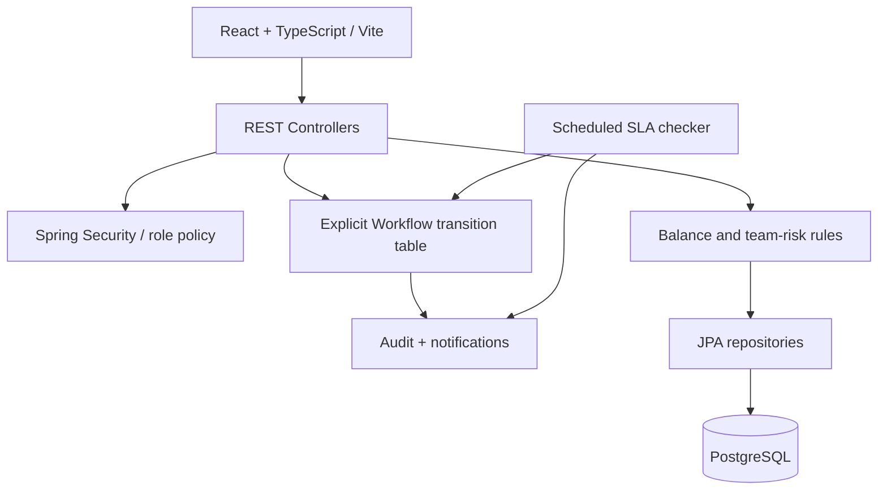

# Architecture

```mermaid
flowchart TD
 UI[React + TypeScript / Vite] --> API[REST Controllers]
 API --> SEC[Spring Security / role policy]
 API --> WF[Explicit Workflow transition table]
 API --> RULES[Balance and team-risk rules]
 WF --> AUDIT[Audit + notifications]
 RULES --> JPA[JPA repositories]
 JPA --> DB[(PostgreSQL)]
 S[Scheduled SLA checker] --> WF
 S --> AUDIT
```
