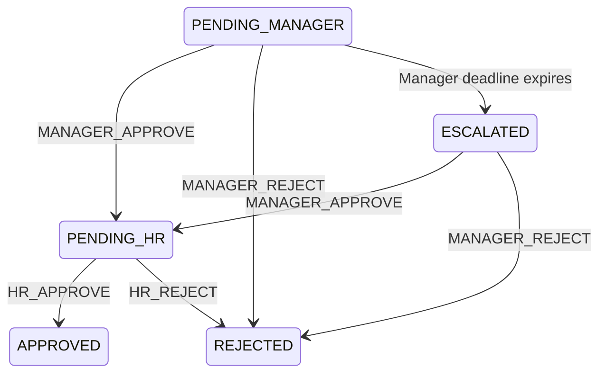

# Leave workflow

Escalation changes visibility and creates an audit event; it never grants approval. Terminal states have no outgoing actions. The database stores a single `ESCALATED` status, matching the supplied schema.
